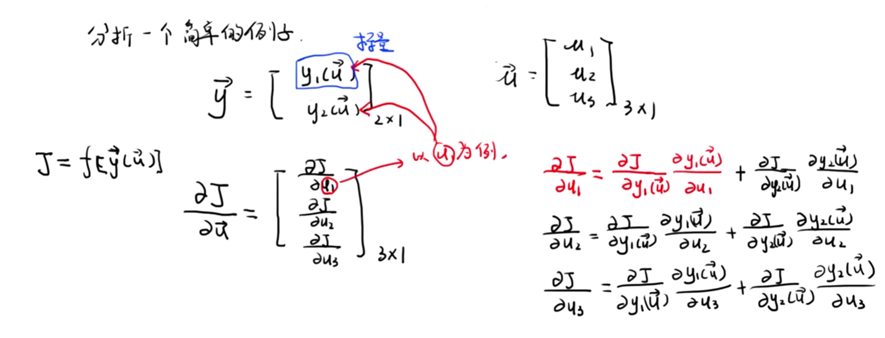
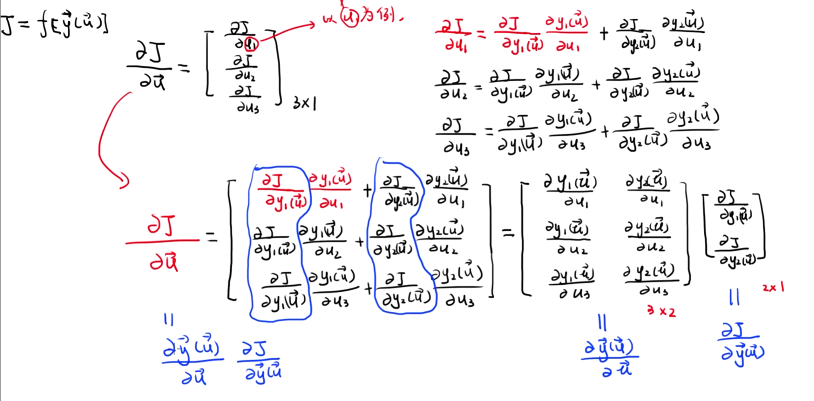
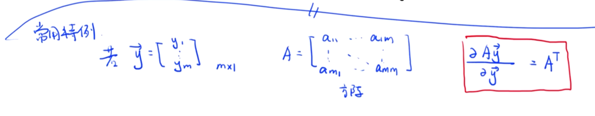
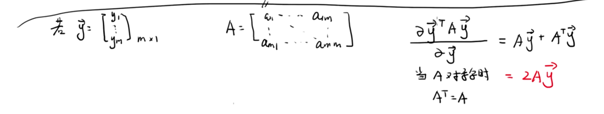

# Matrix-Derivatives
矩阵求导

# 视频教程
## https://www.bilibili.com/video/BV1av4y1b7MM/?spm_id_from=333.337.top_right_bar_window_history.content.click&vd_source=f24dd1851efb1fb158e00a56a4342458
### 标量方程对标量求导、链式法则
### 标量方程对向量求导、链式法则

### 向量方程对标量求导、链式法则
### 向量方程对向量求导、链式法则
### 分母布局

### 分子布局

## https://www.bilibili.com/video/BV1xk4y1B7RQ/?spm_id_from=333.1391.0.0